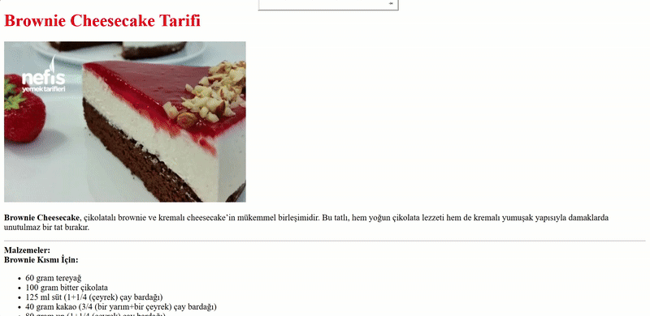

# Brownie_tarifi
Ekran Görüntüsü

Proje Açıklaması
Bu proje, lezzetli bir Brownie Cheesecake tarifini sunan basit bir web sitesidir. Tarif, çikolatalı brownie ve kremalı cheesecake'in mükemmel birleşiminden oluşur ve adım adım yapılışını içerir.

Dosyalar
index.html - Ana sayfa. Brownie Cheesecake tarifinin malzemelerini ve yapılış adımlarını içerir.

tarifli.html - Tarifin yapılışını gösteren fotoğrafları içeren sayfa.

Kullanım
Ana sayfada (index.html) tarifin detaylarını ve malzemelerini bulabilirsiniz.

"Resimler için buraya tıklayınız!" bağlantısına tıklayarak tarifin yapılışını gösteren fotoğrafları görüntüleyebilirsiniz (tarifli.html).

Geliştirme
Bu proje, temel HTML kullanılarak oluşturulmuştur. Daha fazla özellik eklemek için CSS ve JavaScript kullanılabilir.

Katkıda Bulunma
Eğer bu projeye katkıda bulunmak isterseniz, lütfen bir "Pull Request" açın. Yeni özellikler, düzeltmeler veya iyileştirmeler memnuniyetle karşılanır.